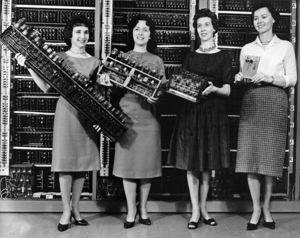
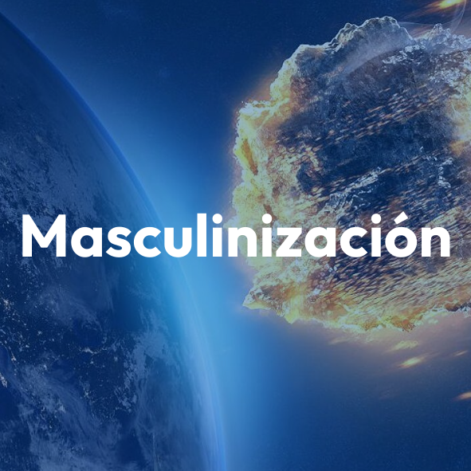
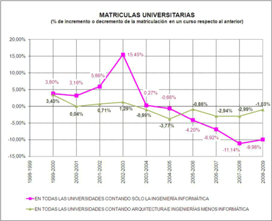
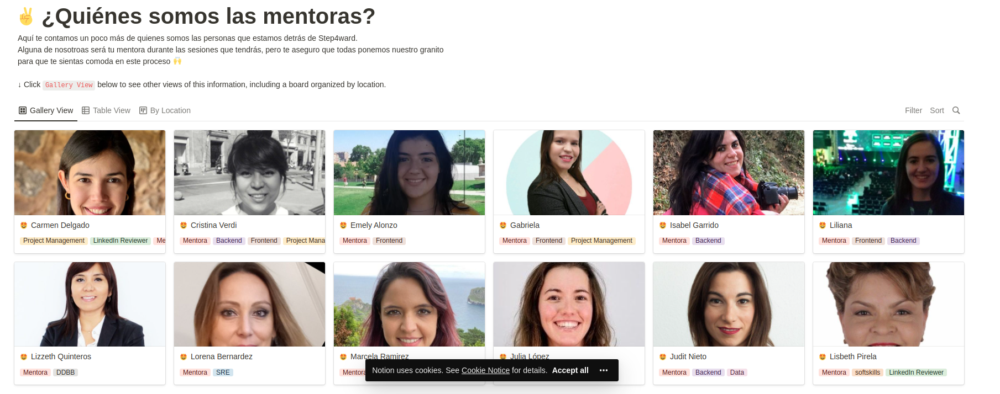

# La nueva generación


# de mujeres programadoras


Espera un momento, ¿hay una nueva generación de mujeres programadoras?


¿Qué pasó con la anterior generación de mujeres programadoras?


Bueno, veamos un poco de historia...


### Los años dorados de la mujer en programación


¿Cuándo diríais que fue esa época dorada?


### Décadas 60-80





#### Punto de inflexión en los 80


¿Por qué?
¿Qué está pasando?


Un meteorito llamado...



Y otro llamado...


Gender Codes: Why women are leaving computing


Gender Codes: Why women are leaving computing


## Sabías que....


El número de mujeres profesionales ha crecido año tras año


* En **profesiones tradicionalmente masculinizadas, como Medicina o Leyes**
* En **todas las carreras de ciencia y en todas las ingenierías**


Excepto... sí, has adivinado


Excepto en Informática...
* Donde ha ido disminuyendo año tras año hasta llegar al **18% de estudiantes**.
* Y el **13% de mujeres programadoras profesionales**





Pero... ¡hay esperanza!


## La nueva generación de mujeres programadoras


¿Quiénes son?


# Valientes


## (Des)arrolladoras


¿Qué las ha empujado al cambio?


¿Qué podemos hacer para impulsarlas?


Ayudarlas a


# Entrar


# Crecer


# Permancer


¿Cómo?


* Paso 1: Formar a mujeres en programación
* Paso 2: Conseguir que encuentren empleos que les permitan desarrollar sus habilidades


* Paso 3: Conseguir que permanezcan en el sector año tras año, para adquirir *Seniority* y que sean las líderes y referentes de mañana.
* Paso 4: Conseguir que las empresas a las que van sean diversas, inlcusivas y que ofrezcan igualdad de oportunidades.


## ¿Qué puedo hacer yo?


* Si eres tienes un cargo de responsabilidad en una empres
* Si eres líder en tech <!-- .element: class="fragment" data-fragment-index="2" -->
* Si eres un programador <!-- .element: class="fragment" data-fragment-index="3" -->
* Si eres una comunidad <!-- .element: class="fragment" data-fragment-index="4" -->
* Si eres una programadora <!-- .element: class="fragment" data-fragment-index="5" -->


### Si tienes cargo de responsabilidad en una empresa


```js
function CrearBuenTerrenoParaQueGerminenLasSemillas() {
   return 👩‍💻🚀
}
```


Ve a tu entorno del día a día y ejecuta la función:
```js
    CrearBuenTerrenoParaQueGerminenLasSemillas()
```


* Busca asesoramiento en D&I&E
* Apoya a lxs líderes en tecnología para desarrollar habilidades del denominado *Liderazgo Femenino*.
* Cuidado con traer gente tóxica a tus equipos.
* Incorpora mecanismos para detectar gente tóxica en tu proceso de selección.
* Toma acción para fomentar un entorno inclusivo, a todos los niveles


* Presta atención a lo que pasa en los equipos.
* Monitoriza contínuamente la brecha que hay entre tus políticas y el día a día
* Acciones para reducir esa brecha


* Tolerencia cero a faltas de respeto o discriminación, cualquiera, entre compañerxs.
* Tu responsabilidad es erradicar la toxicidad
* Asegúrate de que se crean oportunidades para que todas podamos avanzar en nuestras carreras.
* Ayuda a que el equipo madure, creando un espacio inclusivo donde unxs y otrxs se apoyan para crecer.


* Valora la experiencia profesional y vital de esta nueva generación de mujeres programadoras y sácale partido
* 💰💰💰 El talento bien aprovechado, es muy rentable


### Si eres líder o lideresa en *tech*


```js
function CrearBuenTerrenoParaQueGerminenLasSemillas() {
   return 👩‍💻🚀
}

function SoySponsor() {
    return 👩‍💻🚀✨✨
}
```


Ve a tu entorno del día a día y ejecuta:
```js
    CrearBuenTerrenoParaQueGerminenLasSemillas()
    ConviérteteEnSponsor()
```


* Valora la experiencia profesional y vital de esta nueva generación de mujeres programadoras y sácale partido
* 🔥🔥🚀🚀 El talento bien aprovechado, hará que el equipo y la empresa llegue lejos
 
 
* Apoya la progresión de carrera
* Recomienda para oportunidades que ayudarán a crecer


### Si eres programador


```js

function SoyUnAliado() {
   return 👩‍💻🚀
}

```


Ve a tu entorno de trabajo y ejecuta:

```js

SoyUnAliado()
SoySponsor()

```


* Busca las situaciones que te ayuden a generar empatía
* Apoya las aportaciones de tus compañeras dándoles credibilidad públicamente:
* [El respeto y la autoridad se generan según el número de validaciones públicas que recibe una persona cuando expresa una idea.](https://link.springer.com/article/10.1007/BF00987046?noAccess=true)


##### Cede espacios

* Da tiempo a que las demás respondan y expresen sus ideas. No te precipites
* Cuando te ofrezcan una buena oportunidad, cede espacios y recomienda a tus compañeras.
A ti te van a a llegar muchas más oportunidades.


##### Cede espacios

* Cuando estés solo, haciendo una tarea interesante y retadora, busca una compañera para hacer pairing.


##### Apoya la reputación y credibilidad de tus compañeras

No interrumpas cuando tu compañera está hablando.


[La credibilidad  y autoridad de una persona disminuye de forma proporcional al número de interrupciones que recibe](https://web.stanford.edu/~eckert/PDF/jamesClarke.pdf)


>  [...]The researchers found 48 total interruptions—and 46 of them were instigated by the man.[...]"


[Sex roles, interruptions  and silences in conversations](http://web.stanford.edu/~eckert/PDF/zimmermanwest1975.pdf)


> Men interrupted 33 percent more often when they spoke with women than when they spoke with other men according to study from **George Washington University**


> But **there are ways to address the issue**, Leslie Shore, a communication expert and author of "Listen to Succeed," writes in *Forbes*. Shore **recommends some strategies**:


> Men should pause before they interrupt someone and consider the implications [...]
 


> Women should push back if they are interrupted for any other reason than clarity [...]


# Señala comportamientos inapropiados


Gracias por esforzarte ❤️ cada día

```js

SoyUnAliado()
SoySponsor()

```


#### Si organizas una comunidad que apoya la D&I&E


###### Sigue así, lo conseguiremos
❤❤👏👏


- Sigue creando espacios para que las programadoras seamos visibles
- Sigue buscándonos e invitándonos a participar en tus eventos. Aunque  a veces te digamos que no.


Crea alianzas con otras comunidades con tus mismos valores


- Sigue buscando y visibilizando a programadoras no tan conocidas. Llegarán a serlo.
- Gracias por tus esfuerzos para crear espacios diversos e inclusivos


#### Si eres programadora


- Formarte. Consolidar tu conocimiento de los fundamentos
- Pregunta a otras programadoras sobre la empresa, antes de entrar
- Aprender a salir y decir tu opinión. En cada oportunidad toma la palabra.


- Conoce las reglas del juego y úsalas. Este es un entorno que se mueve por el expertise que demuestres.
- [Haz que tu conocimiento, tus ideas y tu trabajo sean visibles y públicos](https://patricia.no/2019/09/12/survival_tips_for_women_in_tech.html).


*Erradica* de tu vocabulario las expresiones:


"Lo siento", "Igual no tengo razón", "A lo mejor me equivoco", "Estoy empezando", "No sé mucho de esto" "seguro que sabéis más que yo", "Vosotros tenéis más experiencia y lo sabréis mejor"


y todas sus variantes.


- Apoya siempre e incondicionalmente a todas las programadoras que conozcas.
- Lánzate a por las oportunidades que se te presenten.

- Busca mentoras y mentores aliados.
  - 🏅Code Sherpas🏅
  - ✨Step4ward✨


##### Encuéntranos en ✨Step4Ward✨
[](https://step4ward.notion.site/step4ward/Bienvenidas-a-Step4ward-2b133826a10a4fc6a5bc7686605f6357)


- Busca apoyos para desarrollar tu resiliencia
- Busca apoyos para desarrollar tu autoconfianza


Ponte a ti primero, tu carrera es importante. 
Tenlo presente especialmente si tienes personas a tu cargo.


Te invito a que te hagas esta pregunta:


> Dentro de 5 o 10 años, cuando se haya acabado esta etapa de cuidados, ¿qué habré contruido para mi?


- Cuida tu salud, esto es una carrera de fondo, no un *sprint.*
- No te olvides de que tienes experiencia vital y hasta una carrera profesional a las espaldas.


Ten paciencia contigo misma al inicio. Esto es lo tuyo y vales mucho. Sólo estás adquiriendo una nueva competencia profesional


- Honra a la versión de ti misma que te ha traído hasta este nuevo camino. 
- Honra todo el esfuerzo que has hecho para llegar hasta aquí.
- Valora todos tus aciertos hasta ahora y acepta los desaciertos.


- Honra todos lo años de estudio que le dedicaste a tu carrera anterior. 
- No te preocupes, no se queda atrás, en un momento u otro fusionarás tus dos mundos y todo cobrará sentido.🚀✨✨


- Cuando estés en tu nuevo rol, ten presente que tú ya tienes una mochila de conocimientos y que son un multiplicador tremendo.
- Aprende a aplicarlos en este campo y empieza a recoger el valor.🔥🔥🚀🚀


```js

function BeAwesome() {
    return return 👩‍💻🚀✨✨
}

```


Cuando estés en tu día a día, simplemente:

```js

✨✨ BeAwesome() ✨✨

```


🦄


Me pidieron que explicara qué estoy haciendo para materializar el liderazgo técnico.


## Hace un año...


# Entrar


# Crecer


# Permancer


##### La chispa inspiradora


##### Cofounders incansables


> Gracias a los que nos apoyáis para que podamos seguir haciendo nuestro cachito de mundo, un poco mejor


Nos mueve el hacer crecer a la nueva generación de mujeres programadoras
 


## ¿Te unes a nosotras?


##### ¿Quieres ser ingeniera de software?
[](https://academy.code-sherpas.rocks/computer-science-fundamentals)


##### ¿Quieres especializarte en backend?
[](https://academy.code-sherpas.rocks/backend-entry-level)


> Tenemos una gran responsabilidad. Hay muchas personas, como las maravillosas programadoras que os he mostrado, que necesitan que les sigamos abriendo puertas y oportunidades
 


> Para completar nuestra misión, queremos sumar a personas influyentes en **empresas**, que compartan nuestra misión y que se conviertan en nuestras **aliadas y sponsors**.
 


##### ¿Colaboramos?
[](https://www.code-sherpas.rocks/empresas)


## ❤️ ¡Gracias!
###### [Cristina Twitter](https://twitter.com/cristina_verdi) | [Cristina Linkedin](https://www.linkedin.com/in/cristina-verdi/)
###### [Code Sherpas Twitter](https://twitter.com/codesherpas_bcn) | [Slack Code Sherpas](https://launchpass.com/code-sherpas)


